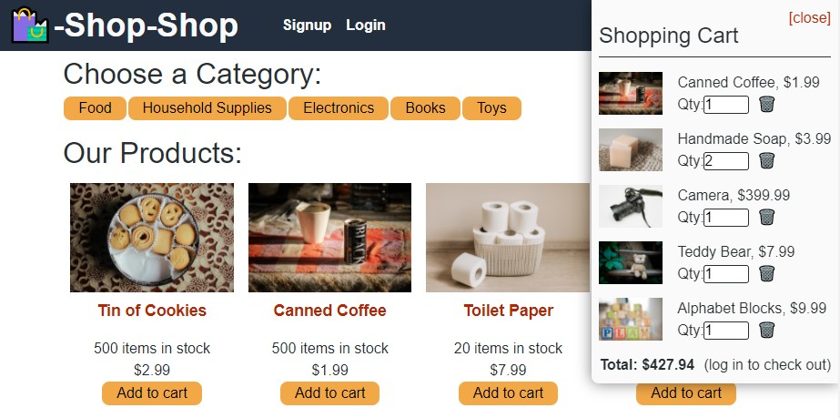

# :credit_card: Shop-Shop :credit_card:
An E-commerce site built using Redux

[Check It Out Here!](https://shopping-ecomm.herokuapp.com/)

# :memo: Description 

    AS a senior engineer working on an e-commerce platform
    I WANT my platform to use Redux to manage global state instead of the Context API
    SO THAT my website's state management is taken out of the React ecosystem
    GIVEN an e-commerce platform that uses Redux to manage global state
    WHEN I review the app’s store
    THEN I find that the app uses a Redux store instead of the Context API
    WHEN I review the way the React front end accesses the store
    THEN I find that the app uses a Redux provider
    WHEN I review the way the app determines changes to its global state
    THEN I find that the app passes reducers to a Redux store instead of using the Context API
    WHEN I review the way the app extracts state data from the store
    THEN I find that the app uses Redux instead of the Context API
    WHEN I review the way the app dispatches actions
    THEN I find that the app uses Redux instead of the Context API